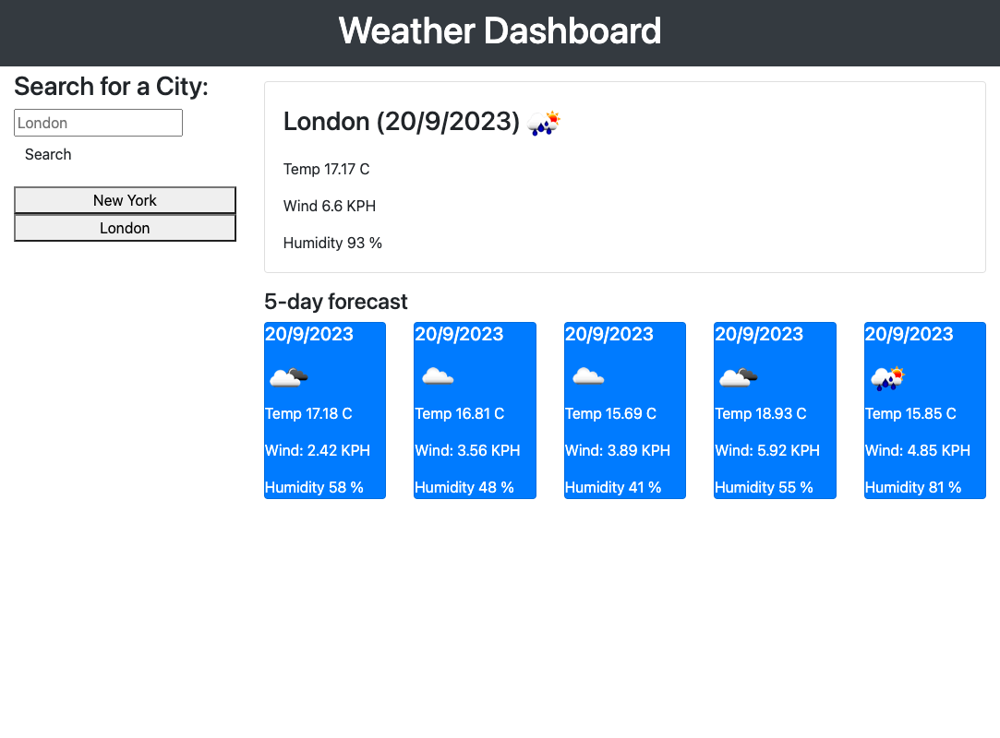

# Weather Dashboard with 5-Day Forecast 

## Overview

The Weather Dashboard with 5-Day Forecast is a front-end web application that allows users to check the current weather conditions and the 5-day weather forecast for a specific location. This project was developed as a front-end development exercise and uses HTML, CSS, and JavaScript to fetch and display weather data from a third-party API.

## Features

- **Current Weather:** Users can view the current weather conditions for a chosen location, including temperature, humidity, wind speed, and a brief description of the weather.

- **5-Day Forecast:** The application provides a 5-day weather forecast for the selected location, showing temperature and weather conditions for each day.

- **Location Search:** Users can search for weather information for any location worldwide by entering the city name.

- **Responsive Design:** The dashboard is designed to work on both desktop and mobile devices, ensuring a seamless user experience.

## Screenshot

## Getting Started

To run the Weather Dashboard on computer or smartphone, open the link in a browser.

## Link
https://mam-rahman.github.io/Weather-Dashboard-API/

## License
MIT License 
2023 Mam-Rahman